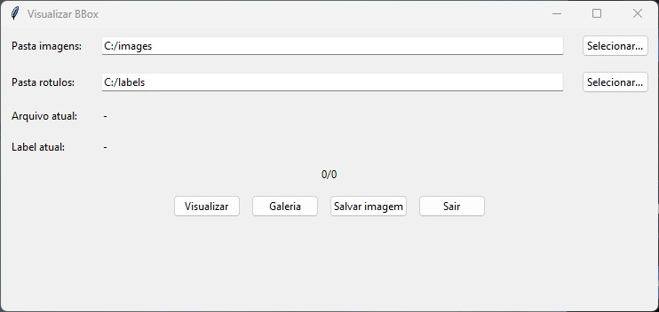
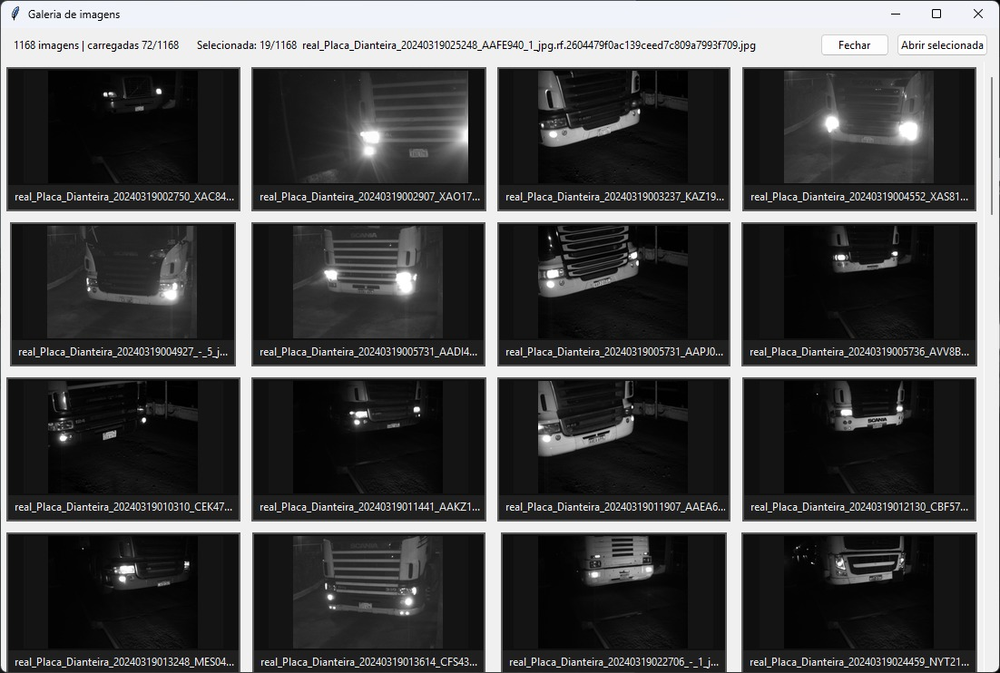
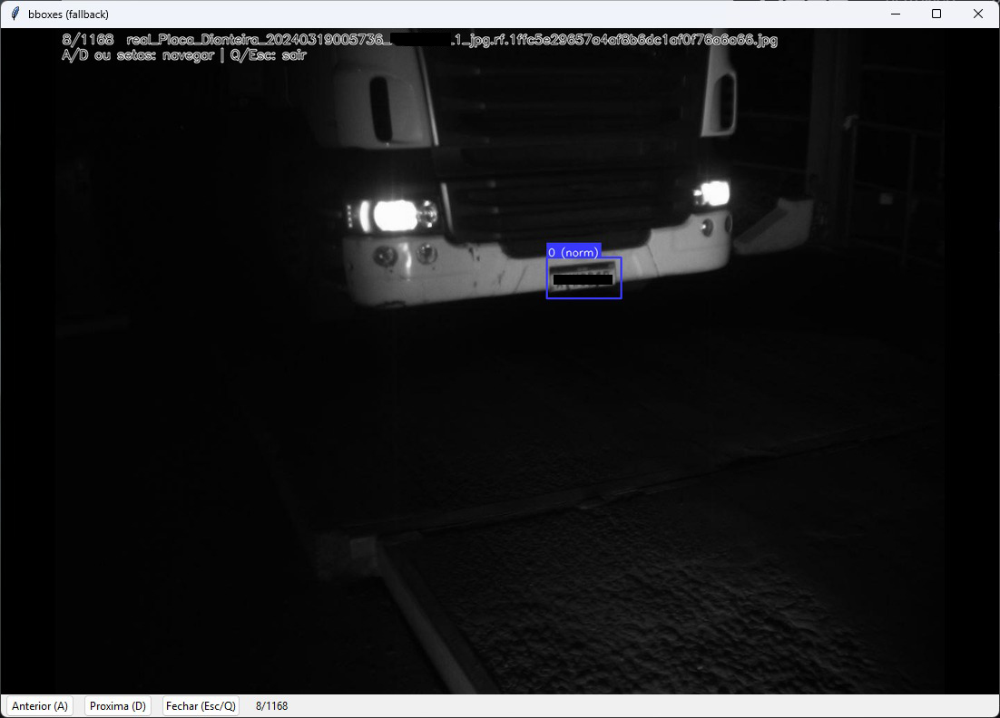

# visualizador-bbox-yolo

Aplicacao para visualizar bounding boxes no formato YOLO em imagens, com suporte a uso por linha de comando (CLI) e interface grafica (GUI).

## O que a aplicacao faz

- Le uma imagem e um arquivo de rotulos `.txt` no formato YOLO (`classe cx cy w h`).
- Desenha as caixas com cor por classe e legenda no topo de cada bbox.
- Detecta automaticamente se os valores do rotulo estao normalizados (`0..1`) ou em pixels.
- Salva a imagem anotada com `--out` (CLI) ou pelo botao `Salvar imagem` (GUI).
- Permite navegar entre varias imagens (atalhos `A` e `D`) e abrir galeria de miniaturas na GUI.

## Requisitos

Instale as dependencias principais:

```bash
pip install -r requirements.txt
```

Dependencia opcional (recomendada para galeria e fallback visual):

```bash
pip install pillow
```

## Como usar

### 1) Modo CLI (uma imagem)

Visualizar uma imagem com seu rotulo:

```bash
python visualizador_bbox_yolo.py "caminho/para/imagem.jpg" "caminho/para/imagem.txt"
```

Salvar resultado em arquivo:

```bash
python visualizador_bbox_yolo.py "caminho/para/imagem.jpg" "caminho/para/imagem.txt" --out "saida/annotada.jpg"
```

### 2) Modo GUI (pastas)

Abrir interface grafica:

```bash
python visualizador_bbox_yolo.py --gui
```

Ou simplesmente:

```bash
python visualizador_bbox_yolo.py
```

Na GUI:

- `Pasta imagens`: selecione a pasta com arquivos `.jpg`, `.jpeg`, `.png`, `.bmp`, `.tif`, `.tiff`.
- `Pasta rotulos`: selecione a pasta com os `.txt` correspondentes.
- O script associa imagem e rotulo pelo mesmo nome base:
  - `foto_001.jpg` -> `foto_001.txt`
- Botoes disponiveis:
  - `Visualizar`: abre a imagem atual com as caixas.
  - `Galeria`: abre miniaturas para selecao rapida.
  - `Salvar imagem`: exporta a imagem anotada.

Atalhos principais:

- `A`: imagem anterior
- `D`: proxima imagem
- `Q` ou `Esc`: fechar visualizacao

## Formato dos rotulos YOLO

Cada linha do `.txt` deve ter pelo menos 5 campos:

```txt
id_classe centro_x centro_y largura altura
```

Exemplo:

```txt
0 0.512 0.433 0.220 0.180
1 0.250 0.700 0.150 0.120
```

Observacoes:

- Linhas em branco e linhas iniciadas com `#` sao ignoradas.
- Se houver mais de 5 colunas, apenas as 5 primeiras sao usadas.

## Executavel

Se preferir, voce tambem pode usar o executavel incluido no projeto:

```bash
VisualizarBBox.exe
```

## Capturas da aplicacao







